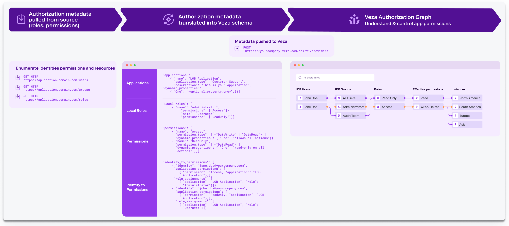

## Veza Overview
Veza is the authorization platform for data. Our platform is purpose-built for multi-cloud environments to help you use
and share your data more safely. Veza makes it easy to dynamically visualize, understand and control who can and should
take what action on what data. We organize authorization metadata across identity providers, data systems, cloud service
providers, and SaaS applications — all to help organizations with critical use cases of access governance, privilege
access, cloud entitlements, data lake security, etc. To learn more, please visit us at [veza.com](https://veza.com).

## Open Authorization API

Veza natively supports 40+ integrations natively for systems such as Azure SharePoint, Snowflake, AWS services, GCP services,
SQL Server, etc. That said, there are often scenarios where organizations want to integrate Veza to an in-house system, or a
custom SaaS application, or any system (databases, etc.) that we don’t yet support natively. You might have a custom or
homegrown SaaS or on-prem app - for example, a customer service or support app that holds or accesses sensitive data - for
which you want to visualize and manage access to these critical systems. Our Open Authorization API (OAA) enables Veza customers
 and partners to integrate custom and other 3rd party SaaS applications and data systems using a standard interface.

OAA connector has 3 jobs: it needs to pull authorization data from the target system (i.e., SaaS app, data storage system, or
custom software, etc.), transform that data into a format Veza understands, and call the Veza API to import the data into Veza.
Using OAA and connectors, organizations can parse and upload authorization metadata for custom SaaS apps and create a more
complete view of permissions across cloud/data/identity systems to answer the question: “who can and should take what action
on what data?”

Open Authorization API is not currently associated with any open source bodies (IETF, etc.). We will be working with various
teams to pursue open standards over course of time. All OAA resources in this repository are licensed under the MIT license.

## How OAA Works
OAA works by providing a mechanism to upload authorization information from a target system to Veza in a standardized
format. To integrate a new system, you utilize that system's API (or other interfaces) to enumerate the identities,
permissions and resources that you want available in Veza. This information must then be formatted according to the OAA
JSON schema and uploaded to Veza using the OAA REST API.



Veza processes this schema mapping to integrate metadata from the new target system into its Authorization Metadata
Graph, which maps which identities have what permissions to what resources. Veza combines this information with
discovered data from Identity providers to expand group memberships and correlate identities. Identities can be local to
that application or linked to external Identity Providers (IdP) like Okta or AzureAD. The Veza schema can capture and
represent both standard Effective Permissions (Create, Read, Update, and Delete) as well as system-specific permissions
(like “Admin” or “Operator”).

Once a target application or system is integrated via OAA into Veza, it acts like any other data source. OAA-integrated
systems are fully available for the purpose of Veza search, governance workflows, reports, alerts, and more.

## Working with OAA
Customers have the choice of integrating with the Open Authorization API directly through REST or leveraging the Python
SDK. Customers who choose the REST option can develop in any language they like to collect the authorization data,
format the OAA template and make REST calls.

### Example Custom Application Payload

Below is a simplified example of defining authorization information for a custom application template. This example
demonstrates defining two users and two different permissions to access an application.

```javascript
{
  "applications": [
    {
      "name": "Support Portal",
      "application_type": "support_portal",
      "description": "Our customer support portal",
      "local_users": [
        {
          "name": "bob",
          "identities": [
            "bob@example.com"
          ],
          "groups": [
            "admins"
          ],
          "is_active": true,
          "last_login_at": "2022-03-21T18:56:38Z"
        },
        {
          "name": "sue",
          "identities": [
            "sue@example.com"
          ]        }
      ],
      "local_groups": [
        {
          "name": "admins"
        }
      ]
    }
  ],
  "permissions": [
    {
      "name": "admin",
      "permission_type": [
        "DataWrite",
        "DataRead",
        "DataDelete",
        "MetadataWrite",
        "MetadataRead"
      ]
    },
    {
      "name": "login",
      "permission_type": [
        "DataRead",
        "MetadataRead"
      ]
    }
  ],
  "identity_to_permissions": [
    {
      "identity": "bob",
      "identity_type": "local_user",
      "application_permissions": [
        {
          "application": "Support Portal",
          "permission": "login"

        }
      ]
    },
    {
      "identity": "sue",
      "identity_type": "local_user",
      "application_permissions": [
        {
          "application": "Support Portal",
          "permission": "login"

        }
      ]
    },
    {
      "identity": "admins",
      "identity_type": "local_group",
      "application_permissions": [
        {
          "application": "Support Portal",
          "permission": "admin"
        }
      ]
    }
  ]
}
```

Once the authorization payload is formatted into the OAA template the data is posted to the Veza REST API. Veza parses
the payload and loads the data into the Authorization Metadata Graph

### Example Using the SDK

Also available is the `oaaclient` Python SDK that simplifies creation of the authorization payload and submission to
Veza. The SDK provides interfaces to creating all the support OAA template components and registering new sources with
Veza.

```python
from oaaclient.client import OAAClient, OAAPermission
from oaaclient.templates import CustomApplication

# creates a connection class to communicate with Veza
veza_con = OAAClient(url=veza_url, token=veza_api_key)

# creates a new Custom Application model
custom_app = CustomApplication(name="Sample App", application_type="sample")
```

Once the `CustomApplication` class is instantiated you can access the public methods to add local users, groups and
resources and the authorization between identities and resources.

```python
# define new permission
custom_app.add_custom_permission("owner", [OAAPermission.DataRead, OAAPermission.DataWrite])
# add users and identities
jane = custom_app.add_local_user("jane", identities="jane@example.com")
# add resources to the application to collect more granular authorization information
resource1 = custom_app.add_resource(name="Resource 1", resource_type="thing")
# associate identities to resources based on their permissions
jane.add_permission(permission="owner", resources=[resource1])
```

## Getting Started

See the [OAAClient SDK repository](https://github.com/Veza/oaaclient-py) for more information on using the Python SDK.
See the [OAA Community repository](https://github.com/Veza/oaa-community) for existing community connectors.

## Join Us on Slack
Join us on Slack at [#veza-oaa-community](https://join.slack.com/t/veza-world/shared_invite/zt-17d9quyiq-20JMp0ikZ0pVNz_e5W5j7Q)
